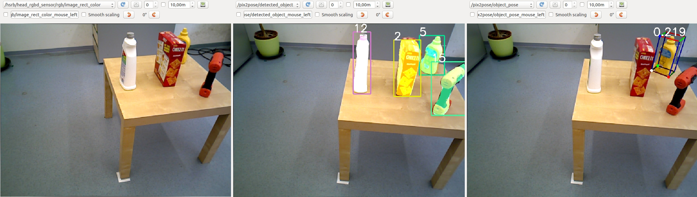

List of parameters for running Pix2Pose with ROS

* detection_pipeline/path_to_detection_pipeline: information for a 2D detection pipeline ("rcnn","retinanet"), "retinanet will be supported soon"
* path_to_pix2pose_weights: to make everything out of the BOP formant, specify the directory that stores weights for each object. The directory should be organized with object numbers with two digits. e.g., 01, 02 ... 10.  
* inlier_th,ransac_th,outlier_th: three main threshold for Pix2Pose. To increase inference speed, less outlier threholds can be used.
* norm_factor_fn: normalized factor for each object. This file is automatically generated when converting 3D models into colored coordinate models using "2_1_ply_file_to_3d_coord_model.py"
* obj_labels:labels of objects corresponding to the detection outputs, the number of labels should be the same with "n_objs"
* target_obj_name: names of target objects that are going to be estimated. If no obj_name is given as [], only 2d detection results will be published.
* icp (ignored): 1-run icp, 0-w/o icpg
* model_dir: a directory that contains .ply files of objects. Ply files is used for ICP and visualization.
* ply_files: filenames 3D models corresponding to the order of "target_obj_name"
* model_scale: a  scaling factor to convert models into the meter scale
* rgb_topic: ros topic for color images
* depth_topic: ros topic for depth images
* cam_K, im_height, im_width: camera information (precise cam_K is important to obtain accurate results)

### Requirements
* ros-kinetic with python packages
* ros_numpy
* (for ICP) pyrender (pip3 install pyrender)
* (for ICP) trimesh (pip3 install trimesh)

### Execute the ros node
Run the rosnode by,
```
python3 ros_kinetic/ros_pix2pose.py
```

The results will be published in topics, /pix2pose/detected_object and /pix2pose/object_pose, which are visualization of detection results and pose estimation results.

